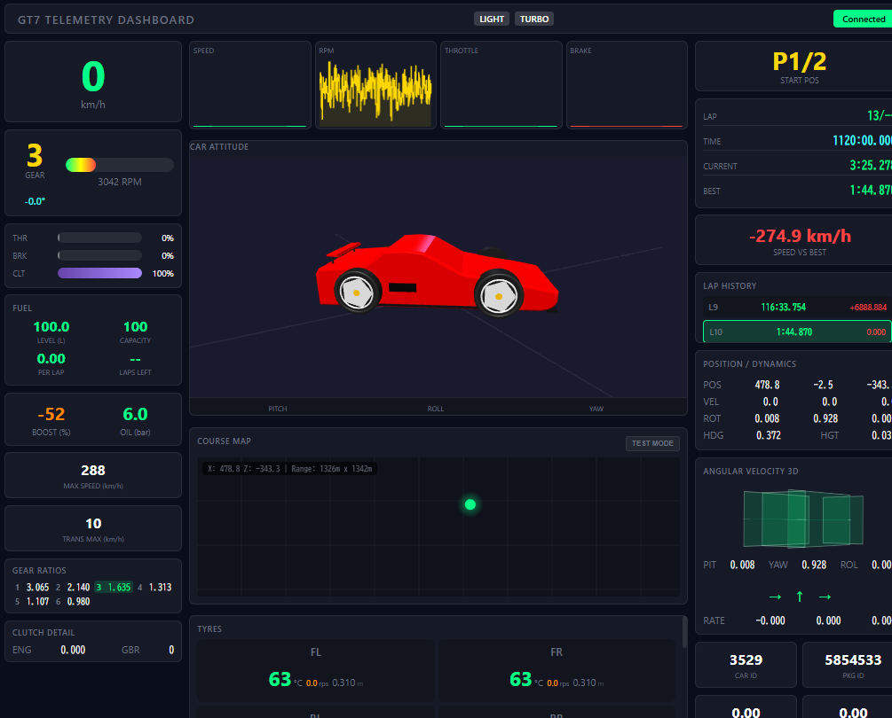

# GT7 Telemetry Dashboard

グランツーリスモ7 (GT7) のリアルタイム・テレメトリダッシュボードです。



## 概要

PS5/PS4 から送信されるテレメトリパケットを受信・Salsa20 復号し、WebSocket 経由でブラウザ上のダッシュボードにリアルタイム表示します。

### 主な機能

| カテゴリ | 内容 |
|----------|------|
| **速度・駆動系** | 速度、RPM、ギア（推奨ギア）、ステアリング角度、ギア比、トルクベクタリング、回生エネルギー |
| **ペダル入力** | スロットル / ブレーキ / クラッチの生値 + TCS/ABS 補正後の値 |
| **タイヤ** | 4 輪の温度（色分け）、サスペンション高さ、ホイール回転速度、タイヤ半径 |
| **車体姿勢** | 3D 姿勢可視化（pitch/yaw/roll）、加速度 G、車体加速度（sway/heave/surge） |
| **燃料** | 残量、タンク容量、1 周消費量、残り周回予測 |
| **コース** | 位置座標からのコース自動判定、走行軌跡の速度別色分けマップ |
| **ラップ** | ラップタイム記録、ベストラップ、速度デルタ |
| **インフラ** | Docker Compose 対応、テストモード（PS5 不要で動作確認可能）、全パケット対応（A/B/~） |

## クイックスタート

### 必須環境

- **グランツーリスモ 7** (PS5 / PS4)
- **Docker** (20.10+) / **Docker Compose** (2.0+)
- PS5 と PC が同一ネットワーク上にあること

### セットアップ

```bash
# 1. クローン
git clone https://github.com/abem/gt7_tool.git
cd gt7_tool

# 2. PS5 の IP アドレスを設定
#    config.json の "ps5_ip" を PS5 の実際の IP に変更
nano config.json

# 3. 起動
docker compose up --build

# 4. ブラウザで開く
#    http://localhost:8080
```

> **PS5 の IP 確認方法:** 設定 → ネットワーク → 接続状態の詳細 → IP アドレス

### テストモード

PS5 がなくてもデモデータで動作確認できます。ダッシュボード右上の **TEST MODE** ボタンを押すと、シミュレーションデータが流れます。詳細は [TEST MODE ガイド](docs/test-mode.md) を参照してください。

## ダッシュボードの表示項目

### 速度・ギア
- 現在速度 (km/h)、最高速度記録
- 現在ギア (R, 1-8)、推奨ギア、ステアリング角度
- RPM バー（レブリミッター・シフトポイント表示）

### ペダル入力
- **THR**: スロットル入力 + TCS 補正値
- **BRK**: ブレーキ入力 + ABS 補正値
- **CLT**: クラッチ位置

### 車体姿勢 (CAR ATTITUDE)
- ミッドシップスポーツカー風 3D モデルによる姿勢可視化
- Pitch / Roll / Yaw のリアルタイム表示
- Angular Velocity 3D 表示

### タイヤ・サスペンション
4 輪（FL/FR/RL/RR）ごとの温度（色分け）、サスペンション高さ、ホイール回転速度、タイヤ半径

### 駆動系・燃料
- ギア比表示（現在ギアをハイライト）
- ブースト圧、油圧、トルクベクタリング、回生エネルギー
- 燃料残量、タンク容量、1 周消費量、残り周回予測

### コース・ラップ
- 走行軌跡を速度別に色分けしたコースマップ
- ラップタイム履歴、ベストラップ差分デルタ、速度デルタ

## 構成

### バックエンド (Python)
| ファイル | 役割 |
|----------|------|
| `main.py` | エントリーポイント。WebSocket サーバー (asyncio + aiohttp) |
| `telemetry.py` | PS5 との UDP 通信（ハートビート送信） |
| `decoder.py` | Salsa20 暗号化パケットの復号・解析。Packet A/B/~ 対応、XOR 自動フォールバック |

### フロントエンド (HTML/CSS/JS)
| ファイル | 役割 |
|----------|------|
| `index.html` | ダッシュボードの HTML 構造 |
| `styles.css` | スタイル定義（レスポンシブ対応） |
| `ui_components.js` | 定数・設定・ユーティリティ・DOM キャッシュ |
| `charts.js` | uPlot チャート・加速度チャート管理 |
| `car-3d.js` | 3D 車両モデル・姿勢可視化 (Three.js) |
| `course-map.js` | コースマップ Canvas 描画 |
| `websocket.js` | WebSocket 接続・テレメトリデータ処理・ラップ管理 |
| `test-mode.js` | テストモード（デモデータ生成） |
| `app.js` | エントリーポイント（各モジュール初期化） |

### 設定・データ
| ファイル | 役割 |
|----------|------|
| `config.json` | ネットワーク設定（PS5 IP、ポート等） |
| `packet_def.json` | テレメトリデータのオフセット・型定義（参照用） |
| `course_database.json` | コース座標範囲データベース |

## ドキュメント

- **[ドキュメントトップ](docs/index.md)** — 目次
- **[ユーザーガイド](docs/USER_GUIDE.md)** — 詳細な使い方・FAQ
- **[トラブルシューティング](docs/common-issues.md)** — よくある問題と対処法
- **[TEST MODE ガイド](docs/test-mode.md)** — テストモードの使い方
- **[API ドキュメント](docs/API.md)** — HTTP/WebSocket API・Python モジュール詳細
- **[システムアーキテクチャ](docs/architecture.md)** — 構成とデータフロー

## トラブルシューティング

| 症状 | 原因 | 対処 |
|------|------|------|
| "Client connected" が出ない | PS5 IP が間違い / テレメトリ送信が OFF | `config.json` の `ps5_ip` を確認、PS5 設定でテレメトリ送信を ON |
| データが表示されない | GT7 未起動 / レース画面でない | GT7 を起動しレースまたはタイムアタックで走行開始 |
| ネットワークエラー | コンテナの状態異常 | `docker compose down && docker compose up --build` |

詳細は [トラブルシューティング](docs/common-issues.md) を参照してください。

## カスタマイズ

### テレメトリ項目の追加
1. GT7 テレメトリ仕様でオフセットを確認
2. `decoder.py` の `_extract_fields()` にフィールドを追加
3. `index.html` に HTML 要素を追加、`websocket.js` で表示処理を実装
4. `docker compose restart` で反映

### UI の変更
`styles.css` でスタイルを変更。機能追加は対応する JS モジュールを編集。

### コースデータベースの更新
```bash
python3 test_course_detection.py --data-dir gt7data
```
または `course_database.json` に手動でコース情報を追加。

## ブランチ構成

| ブランチ | 用途 |
|----------|------|
| `main` | 安定版（バグ修正・ドキュメント更新） |
| `dev` | 開発統合ブランチ |
| `feature/*` | 個別機能の開発 |

## 更新履歴

### 2026-02-14
- **3D 車両モデルリデザイン** — BoxGeometry の直方体からミッドシップスポーツカー風のリアルなサイドプロファイルに刷新。Shape + ExtrudeGeometry による車体造形、大径 5 スポーク風ホイール、丸型 4 灯テールライト、リアウイング等を追加

### 2026-02-13
- **全テレメトリフィールド対応** — ハートビートを `~` に変更し Packet ~ (344 bytes) の全フィールドを取得。ギア比、ステアリング角度、TCS/ABS 補正値、車体加速度、トルクベクタリング、回生エネルギーを追加
- **バグ修正** — タイヤ圧表示 (0x94) を路面法線ベクトルに修正、レース順位 (0x84) をスタート順位 + 参加台数に修正
- **バックエンドリファクタリング** — グローバル変数排除、FuelTracker クラス導入、logging 統一、未使用コード削除（合計 -447 行）
- **フロントエンドリファクタリング** — モノリシックな index.html (1825 行) を機能別ファイルに分割

### 2026-02-11
- **ドキュメント整備・実機テスト完了** — API ドキュメント、ユーザーガイド追加。実機テスト全項目 PASS

### 2026-02-09
- **コース推定・マップ表示機能** — 位置座標からの自動コース判定、リアルタイムコースマップ、テストモード、タイヤ詳細表示

## ライセンス

MIT License

## クレジット

GT7/GT Sport テレメトリの Salsa20 復号ロジックを使用しています。

暗号化キー: `Simulator Interface Packet GT7 ver 0.0`

---
**最終更新**: 2026-02-14
