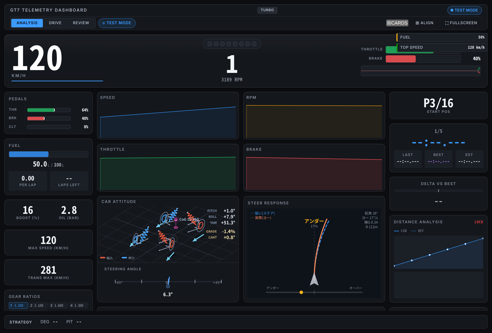

# GT7 Telemetry Dashboard

グランツーリスモ7 (GT7) のリアルタイム・テレメトリダッシュボードです。



## 概要

PS5/PS4 から送信されるテレメトリパケットを受信・Salsa20 復号し、WebSocket 経由でブラウザ上のダッシュボードにリアルタイム表示します。

### 主な機能

| カテゴリ | 内容 |
|----------|------|
| **速度・駆動系** | 速度、RPM、ギア（推奨ギア）、ステアリング角度、ギア比、トルクベクタリング、回生エネルギー |
| **ペダル入力** | スロットル / ブレーキ / クラッチの生値 + TCS/ABS 補正後の値 |
| **タイヤ** | 4 輪の温度（色分け）、サスペンション高さ、ホイール回転速度、タイヤ半径 |
| **車体姿勢 (CAR ATTITUDE)** | Canvas2D クォータービュー可視化 — ダブルウィッシュボーン・サスペンション、タイヤ（ステア連動で前輪が実際に切れる）、重心点 CoG（横 G / 前後 G の荷重移動）、pitch/yaw/roll。車体加速度（sway/heave/surge）は BODY ACCEL に表示 |
| **燃料** | 残量、タンク容量、1 周消費量、残り周回予測 |
| **STEER RESPONSE** | 舵角（ステアリングホイール角）から期待される旋回（狙い=青破線）と実ヨーレートから求めた旋回（実際=橙実線）を弧で比較。バランス比 |ω|/|ω_exp| でアンダー/オーバー判定、車固有の中立ゲインを実走行から自動較正 |
| **ラップ** | ラップタイム記録、ベストラップ、距離基準ライブ・タイムデルタ、推定ラップタイム、セクタータイム |
| **解析** | 距離索引ラップ解析、リファレンス速度重畳チャート、レースエンジニア通知、グリップ状態、一貫性σ |
| **ビュー切替** | DRIVE（走行用最小表示: ギア/シフトライト/デルタ中心、F1 ディスプレイ流）と ANALYSIS（全パネル解析表示）をワンクリック切替 |
| **レイアウト操作** | 全ブロック（カード / チャートタイル / 上部レーシングバー）をドラッグで自由配置（配置は localStorage に保存・ページスクロールに追従）、ヘッダーの操作メニューバー（表示 / モード / 配置 / 設定） |
| **インフラ** | Docker Compose 対応、HTTPS/WSS、テストモード（PS5 不要で動作確認可能）、全パケット対応（A/B/~） |

## クイックスタート

### 必須環境

- **グランツーリスモ 7** (PS5 / PS4)
- **Docker** (20.10+) / **Docker Compose** (2.0+)
- PS5 と PC が同一ネットワーク上にあること

### セットアップ

```bash
# 1. クローン
git clone https://github.com/abem/gt7_tool.git
cd gt7_tool

# 2. PS5 の IP アドレスを設定
#    docker-compose.yml の environment: PS5_IP を直接編集するか、
#    リポジトリ直下に .env を作成し PS5_IP=... を記載（.env.example 参照）
cp .env.example .env
nano .env

# 3. 起動
docker compose up --build

# 4. ブラウザで開く（HTTPS。自己署名証明書のため初回は警告→「詳細設定」から続行）
#    https://localhost:8080
```

> **PS5 の IP 確認方法:** 設定 → ネットワーク → 接続状態の詳細 → IP アドレス
>
> **注意:** `main.py` は環境変数優先・`config.json` フォールバックのため、`docker compose` 起動時は `config.json` の `ps5_ip` を編集しても反映されません。`config.json` の `ps5_ip` は `docker compose` を使わず `python main.py` を直接起動する場合のみのフォールバックです。

### テストモード

PS5 がなくてもデモデータで動作確認できます。ヘッダーの操作メニューバー **モード → TEST MODE** を選ぶと、シミュレーションデータが流れます（もう一度で STOP）。詳細は [TEST MODE ガイド](docs/test-mode.md) を参照してください。

## ダッシュボードの表示項目

### DRIVE / ANALYSIS ビュー

実車テレメトリの「ドライバー表示」と「エンジニア解析」の分離ドクトリン（F1 ステアリングディスプレイ / MoTeC i2 の設計原則）に基づき、操作メニューバー **表示 → ANALYSIS / DRIVE** で 2 つのビューを切り替えられます。選択はブラウザに保存されます。

| ビュー | 用途 | 表示内容 |
|--------|------|----------|
| **DRIVE** | 走行中 | ギア（特大）+ シフトライト + 速度 + ライブデルタ（大型・緑/赤）を中心に、LAP / LAST / BEST / EST / 燃料残周回 / タイヤ状態色ブロックの 6 項目 + STEER RESPONSE のみ。0.2 秒で読める |
| **ANALYSIS** | ピット/走行後 | 全パネル（チャート、3D 姿勢、タイヤ詳細、距離解析、ラップ履歴等）。従来表示 |

### 速度・ギア
- 現在速度 (km/h)、最高速度記録
- 現在ギア (R, 1-8)、推奨ギア、ステアリング角度
- RPM バー（レブリミッター・シフトポイント表示）

### ペダル入力
- **THR**: スロットル入力 + TCS 補正値
- **BRK**: ブレーキ入力 + ABS 補正値
- **CLT**: クラッチ位置

### 車体姿勢 (CAR ATTITUDE)
Canvas2D のクォータービュー（固定アングルの疑似 3D）で描画。車体は回さず、サスペンションとタイヤに絞って挙動を見せます。
- ダブルウィッシュボーン・サスペンションのワイヤーフレーム（コイルオーバーの圧縮/伸長を色で表示）
- タイヤはステア連動で前輪が実際に切れる（接地方位の矢印つき）
- **重心点 (CoG)**: 横 G / 前後 G による荷重移動を点で可視化（g-g トレイル・1G リング付き。点滅表示）
- Pitch / Roll / Yaw のリアルタイム数値表示
- 旧「G-FORCE」パネルは廃止し、この CAR ATTITUDE に統合

### レイアウト操作（ブロックの移動・メニューバー）
- **ブロックの自由配置**: 各ブロック（カード / SPEED・RPM・THROTTLE・BRAKE チャートタイル / 上部レーシングバー）を掴んでドラッグで自由に移動できます。配置はブラウザに保存され、リロードで復元。ページがスクロールする画面幅では内容と一緒にスクロールします。ブロックをダブルクリックすると、そのブロックだけ元位置へ戻ります。
- **操作メニューバー**: ヘッダーのタイトル直下に Windows 風のメニューバー（**表示 / モード / 配置 / 設定**）。見出しをクリックすると操作一覧が開きます。
  - **表示**: ANALYSIS 表示 / DRIVE 表示
  - **モード**: TEST MODE のみ
  - **配置**: 全ブロックを整列（リセット）
  - **設定**: 全画面表示

### タイヤ・サスペンション
4 輪（FL/FR/RL/RR）ごとの温度（色分け）、サスペンション高さ、ホイール回転速度、タイヤ半径

### 駆動系・燃料
- ギア比表示（現在ギアをハイライト）
- ブースト圧、油圧、トルクベクタリング、回生エネルギー
- 燃料残量、タンク容量、1 周消費量、残り周回予測

### ラップ
- ラップタイム履歴、ベストラップ差分デルタ、セクタータイム

### ラップ解析（距離基準）
- **ライブ・タイムデルタ**: ベストラップと同一距離地点での通過タイム秒差をリアルタイム表示
- **推定ラップタイム**: 走行中の全周外挿タイム + 自己ベスト更新判定
- **リファレンス速度重畳**: 距離軸チャートに現在ラップ + ベストラップの速度を重ねて表示
- **レースエンジニア通知**: 新トップスピード / PB 更新 / 燃料残量 (50-20-10%) / 残り周回 / ファイナルラップを通知フィードに表示
- **グリップ状態・一貫性σ**: タイヤグリップの状態表示とラップタイムのばらつき指標

## 構成

### バックエンド (Python)
| ファイル | 役割 |
|----------|------|
| `main.py` | エントリーポイント。HTTP/WebSocket サーバ (asyncio + aiohttp)。`telemetry_supervisor` による受信タスクの監視・再起動、`on_cleanup` による明示的シャットダウン |
| `telemetry.py` | PS5 との UDP 通信（`asyncio.DatagramProtocol` ベースの非同期受信・ハートビート送信） |
| `decoder.py` | Salsa20 暗号化パケットの復号・解析。Packet A/B/~ 対応、XOR 自動フォールバック |

### フロントエンド (HTML/CSS/JS)
| ファイル | 役割 |
|----------|------|
| `index.html` | ダッシュボードの HTML 構造 |
| `styles.css` | スタイル定義（APEX Broadcast デザインシステム、レスポンシブ対応） |
| `constants.js` | 配色パレット・チャート/マップ共通定数 |
| `ui_components.js` | 定数・設定・ユーティリティ・DOM キャッシュ |
| `charts.js` | uPlot チャート・加速度チャート・距離軸解析チャート管理 |
| `steer-response.js` | STEER RESPONSE ペインの可視化（Canvas2D。舵角から期待される旋回と実ヨーレートから求めた旋回を弧で比較、アンダー/オーバー判定、中立ゲイン自動較正） |
| `car-3d.js` | CAR ATTITUDE の可視化（Canvas2D クォータービュー：ダブルウィッシュボーン・サス、ステア連動タイヤ、重心点 CoG）※旧 Three.js 実装から移行 |
| `lap-manager.js` | ラップタイム記録・履歴管理 |
| `telemetry-analysis.js` | 距離基準ラップ解析（タイムデルタ、推定ラップ、エンジニア通知等） |
| `drive-view.js` | DRIVE ビュー（走行用最小表示）の切替・更新 |
| `websocket.js` | WebSocket 接続・テレメトリデータ処理 |
| `test-mode.js` | テストモード（デモデータ生成） |
| `app.js` | エントリーポイント（各モジュール初期化） |
| `card-drag.js` | ブロックのドラッグ移動（自由配置・localStorage 保存・ページスクロール追従、`window.gt7ResetLayout` を公開） |
| `menu.js` | ヘッダーの操作メニューバー（表示/モード/配置/設定。既存ボタンを隠しプロキシとして駆動） |

### 設定・データ
| ファイル | 役割 |
|----------|------|
| `config.json` | ネットワーク設定（PS5 IP、ポート、SSL証明書パス等） |
| `.env` / `.env.example` | 環境変数による設定上書き（env優先・config.jsonフォールバック） |
| `packet_def.json` | テレメトリデータのオフセット・型定義（参照用） |
| `course_database.json` | コース座標範囲データベース |

### テスト・スクリプト
| ファイル/ディレクトリ | 役割 |
|----------------------|------|
| `tests/test_decoder.py` | Salsa20 復号・XORフォールバック・parse・CourseEstimator の回帰テスト（pytest・12件） |
| `tests/test_course_detection.py` | コース推定ロジックの検証・DB再生成（`--regenerate`） |
| `scripts/` | 開発・検証用スクリプト群（debug/verify/capture系・gitignore対象・本番不含） |

## ドキュメント

- **[ドキュメントトップ](docs/index.md)** — 目次
- **[ユーザーガイド](docs/USER_GUIDE.md)** — 詳細な使い方・FAQ
- **[トラブルシューティング](docs/common-issues.md)** — よくある問題と対処法
- **[TEST MODE ガイド](docs/test-mode.md)** — テストモードの使い方
- **[API ドキュメント](docs/API.md)** — HTTP/WebSocket API・Python モジュール詳細
- **[システムアーキテクチャ](docs/architecture.md)** — 構成とデータフロー
- **[変更履歴 (CHANGELOG)](CHANGELOG.md)** — 何を・どう直したかの時系列記録

## トラブルシューティング

| 症状 | 原因 | 対処 |
|------|------|------|
| ブラウザで接続できない | `http://` でアクセスしている | サーバーは HTTPS 専用。**`https://`** でアクセスし、自己署名証明書の警告は「詳細設定」から続行 |
| 証明書の警告が出る | 自己署名証明書のため正常な動作 | 「詳細設定」→「アクセスする（安全ではありません）」で続行（ローカル利用のため問題なし） |
| "Client connected" が出ない | PS5 IP が間違い / テレメトリ送信が OFF | `.env` または `config.json` の `ps5_ip` を確認、PS5 設定でテレメトリ送信を ON |
| データが表示されない | GT7 未起動 / レース画面でない | GT7 を起動しレースまたはタイムアタックで走行開始 |
| ネットワークエラー | コンテナの状態異常 | `docker compose down && docker compose up --build` |
| `Address already in use` | 別の GT7 ツールが同一ポートを使用中 | `docker ps` で他のコンテナ（例: gt7_tool_car_attitude2）を確認し停止、または `.env` でポート変更 |

詳細は [トラブルシューティング](docs/common-issues.md) を参照してください。

## カスタマイズ

### テレメトリ項目の追加
1. GT7 テレメトリ仕様でオフセットを確認
2. `decoder.py` の `_extract_fields()` にフィールドを追加
3. `index.html` に HTML 要素を追加、`websocket.js` で表示処理を実装
4. `docker compose restart` で反映

### UI の変更
`styles.css` でスタイルを変更。機能追加は対応する JS モジュールを編集。

### コースデータベースの更新

`tests/test_course_detection.py --regenerate` を実行すると、`gt7data/` を解析して `course_database.json` を再生成します（破壊的・上書き）。

> ※ **ホスト側（リポジトリルート）で実行してください**。コンテナ内には `tests/` がコピーされていないため `docker compose exec` では実行できません。`pycryptodome` が必要で、`decoder` モジュールを見つけるためリポジトリルートを `PYTHONPATH` に含める必要があります。

```bash
# ホスト側のリポジトリルートで実行
PYTHONPATH=. python3 tests/test_course_detection.py --regenerate
```

> 💡 **試すだけなら `--output` で本番 DB を上書きせずに確認できます**:
> ```bash
> PYTHONPATH=. python3 tests/test_course_detection.py --regenerate --output /tmp/course_database_test.json
> ```

または `course_database.json` に手動でコース情報を追加。

## ブランチ構成

| ブランチ | 用途 |
|----------|------|
| `main` | 安定版（バグ修正・ドキュメント更新） |
| `dev` | 開発統合ブランチ |
| `feature/*` | 個別機能の開発 |

## 更新履歴

> 全変更の詳細な時系列は [CHANGELOG.md](CHANGELOG.md) を参照。直近のバックエンド改修の技術詳細は [docs/refactoring-2026-07-08.md](docs/refactoring-2026-07-08.md) を参照。

### 2026-07-10 — CAR ATTITUDE 刷新・ブロック自由配置・操作メニューバー
- **CAR ATTITUDE を Canvas2D 化**（旧 Three.js 3D モデルから移行）— 車体は回さず、ダブルウィッシュボーン・サスペンションとステア連動タイヤに絞ったクォータービュー可視化に刷新。**重心点 (CoG)** を追加し、横 G / 前後 G による荷重移動を点滅点＋g-g トレイルで表示。旧「G-FORCE」パネルを廃止して CAR ATTITUDE に統合
- **ブロックの自由配置** — 全 25 ブロック（カード / SPEED・RPM・THROTTLE・BRAKE チャートタイル / 上部レーシングバー）をマウス/タッチでドラッグして自由に移動（`card-drag.js`）。配置は localStorage に保存しリロードで復元、ダブルクリックで個別リセット。浮遊は `position:absolute`＋ドキュメント基準座標のためページスクロールに追従（狭い画面幅で固定されてしまう不具合を修正）
- **操作メニューバー** — ヘッダーのタイトル直下に Windows 風のドロップダウン・メニューバー（表示 / モード / 配置 / 設定）を新設（`menu.js`）。TEST MODE・ANALYSIS/DRIVE・コースライン着色・配置リセット・全画面表示を一元化。ヘッダーの個別ボタン（TEST MODE / ANALYSIS）はメニューへ統合

### 2026-07-08 — バックエンド安定化と構成整理
- **Salsa20 復号の致命的バグ修正** — `decoder.py` の `_try_decrypt` で `from Crypto.Cipher import Salsa20` の遅延 import が未実装で、5日間・152万件の復号失敗が発生していたのを修正。PS5 実機テレメトリが復活
- **UDP 受信ループの非同期化** — `telemetry.py` を `asyncio.DatagramProtocol` ベースに全面書き換え。`main.py` の空ポーリング（`asyncio.sleep(0.01)`）を廃止し、`telemetry_supervisor` による再起動安全網と `on_cleanup` による明示的シャットダウンを追加
- **構成整理** — 旧亜種（gt7_tool_dev / gt7_tool_car_attitude2 / gt7dashboard）を `archive/` へ退避、デバッグ/検証スクリプトを `scripts/` へ集約、`tests/` に回帰テスト新設（pytest 12件）

### 2026-07-02
- **DRIVE / ANALYSIS ビュー分離** — 実車テレメトリ（F1 ディスプレイ / MoTeC i2 / SimHub）の設計原則を調査し、走行用の最小表示 DRIVE ビューを新設。ギア特大表示 + 大型ライブデルタ + 6 項目ストリップ + コースマップのみに絞り、解析系パネルは ANALYSIS ビューに分離。ヘッダーのボタンで切替、選択は永続化
- **距離基準ラップ解析機構** — 実テレメトリソフト（gt7dashboard / SimHub / Coach Dave Delta）を参考に、距離索引ラップ解析を新モジュール `telemetry-analysis.js` に実装（バックエンド不変・全てフロント計算）。ライブ・タイムデルタ（同一距離でのベスト通過タイム秒差）、推定ラップタイム + PB 判定、リファレンス速度重畳チャート、レースライン着色（スロットル/ブレーキ/コースト + 速度ピーク/バレー）、レースエンジニア通知、グリップ状態・一貫性σを追加
- **ダッシュボード UI 全面リデザイン (APEX Broadcast)** — モータースポーツ中継グラフィック風に刷新。検証済みパレットで過飽和ネオンを全廃し、ニュートラルダーク面 + 単一 azure アクセント + 等幅 tabular 数値の一貫したデザインシステム（72 トークン）に。要素 ID への無ガード参照による毎フレーム例外を修正、TEST MODE でも全チャート・コースマップを初期化

### 2026-06-14
- **コース判定バグ修正** — `real_track`(±10000) によるシャドウイングを解消。最小面積=最も具体的なコースを選択、`real_track` は低 confidence のフォールバックに分離、`verified`/`confidence` を導出（`decoder.py`）。`course_database.json` に `verified` 注記を付与（v1.2.0）。テスト 9 項目追加（全 PASS）。※ `parse()` でのコース表示は実走 bounds 検証まで無効のまま
- **設定の一元管理** — `.env.example` 追加、`main.py` で `PS5_IP` と各ポートを環境変数上書き対応（`config.json` フォールバック維持）
- **HTTPS 対応** — WebSocket/HTTP を SSL 化（`wss://`、`https://<host>:8080`）
- **ダッシュボード強化** — セクタータイム表示、テストモード強化、ラップ情報・デルタ・右パネル改善、視覚効果/レスポンシブ強化（Phase 2 & 3）

### 2026-03-12
- **リファクタリング** — ANGULAR VELOCITY 3DセクションをCAR ATTITUDEに統合、未使用コード削除、websocket.js末尾の不完全なコードを補完

### 2026-02-14
- **3D 車両モデルリデザイン** — BoxGeometry の直方体からミッドシップスポーツカー風のリアルなサイドプロファイルに刷新。Shape + ExtrudeGeometry による車体造形、大径 5 スポーク風ホイール、丸型 4 灯テールライト、リアウイング等を追加

### 2026-02-13
- **全テレメトリフィールド対応** — ハートビートを `~` に変更し Packet ~ (344 bytes) の全フィールドを取得。ギア比、ステアリング角度、TCS/ABS 補正値、車体加速度、トルクベクタリング、回生エネルギーを追加
- **バグ修正** — タイヤ圧表示 (0x94) を路面法線ベクトルに修正、レース順位 (0x84) をスタート順位 + 参加台数に修正
- **バックエンドリファクタリング** — グローバル変数排除、FuelTracker クラス導入、logging 統一、未使用コード削除（合計 -447 行）
- **フロントエンドリファクタリング** — モノリシックな index.html (1825 行) を機能別ファイルに分割

### 2026-02-11
- **ドキュメント整備・実機テスト完了** — API ドキュメント、ユーザーガイド追加。実機テスト全項目 PASS

### 2026-02-09
- **コース推定・マップ表示機能** — 位置座標からの自動コース判定、リアルタイムコースマップ、テストモード、タイヤ詳細表示

## ライセンス

MIT License

## クレジット

GT7/GT Sport テレメトリの Salsa20 復号ロジックを使用しています。

暗号化キー: `Simulator Interface Packet GT7 ver 0.0`

---
**最終更新**: 2026-07-10
