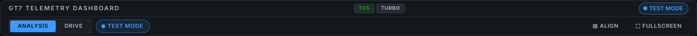

# GT7 Tool ユーザーガイド

## 目次

1. [はじめに](#はじめに)
2. [インストール](#インストール)
3. [初期設定](#初期設定)
4. [ダッシュボードの使い方](#ダッシュボードの使い方)
   - [操作ツールバー](#操作ツールバー)
   - [CARD GROUPS（表示グループ管理）](#card-groups表示グループ管理)
   - [REVIEW ビュー（過去ラップレビュー）](#review-ビュー過去ラップレビュー)
   - [全カード再生（過去ラップの完全リプレイ）](#全カード再生過去ラップの完全リプレイ)
   - [RACE METRICS（実レース由来の解析指標）](#race-metrics実レース由来の解析指標)
   - [ブロックの移動・サイズ変更（自由配置）](#ブロックの移動サイズ変更自由配置)
5. [コース推定機能](#コース推定機能)
6. [テストモード](#テストモード)
7. [トラブルシューティング](#トラブルシューティング)
8. [FAQ](#faq)
9. [キーボードショートカット](#キーボードショートカット)
10. [用語集](#用語集)
11. [サポート](#サポート)
12. [動作確認について](#動作確認について)
13. [ライセンス](#ライセンス)

## はじめに

GT7 Toolは、グランツーリスモ7 (GT7) のテレメトリデータをリアルタイムで表示・分析するためのツールです。PS5/PS4から送信されるデータを受信し、ウェブブラウザ上で美しいダッシュボードとして表示します。

### 主な機能

- **リアルタイムテレメトリ表示**: 速度、回転数、ギア、ペダル入力
- **タイヤ詳細情報**: 4輪の温度、サスペンション、タイヤ半径
- **車体姿勢 (CAR ATTITUDE)**: Canvas2D でサスペンション・ステア連動タイヤ・重心点 CoG（荷重移動）を可視化
- **STEER RESPONSE**: 舵角から求めた狙いの旋回と、実ヨーレートから求めた実際の旋回を弧で比較。アンダー/オーバーステアを判定
- **コース自動推定**: 位置座標から走行中のコースを自動判定
- **ラップタイム記録**: ラップタイムとベストタイムの管理
- **レイアウト操作**: 全ブロックをドラッグで自由配置、ヘッダーの操作ツールバー（ANALYSIS│DRIVE 切替 / TEST MODE / ALIGN / FULLSCREEN）
- **テストモード**: PS5なしで動作確認が可能

---

## インストール

### 必要な環境

- **PS5またはPS4** (GT7がインストールされていること)
- **PCまたはサーバー** (Docker実行環境)
- **同一ネットワーク**: PS5とPCが同じLAN/Wi-Fiに接続されていること
- **Docker** (version 20.10以上)
- **Docker Compose** (version 2.0以上)

### インストール手順

#### 1. リポジトリのクローン

```bash
git clone <リポジトリURL>
cd gt7_tool
```

または、ZIPファイルをダウンロードして展開します。

#### 2. Dockerイメージのビルド

```bash
docker compose build
```

---

## 初期設定

### 1. PS5のIPアドレスを確認

1. PS5のホーム画面から「設定」(歯車アイコン)を開く
2. 「ネットワーク」→「接続状態」を選択
3. IPアドレスをメモする (例: `192.168.1.10`)

### 2. 設定ファイルの編集

`main.py` は環境変数を優先し `config.json` にフォールバックする設計です（`config.json` の `ps5_ip` 等の同名項目は、`docker compose` を使わず `python main.py` を直接起動する場合のみ、環境変数未設定時に使われるフォールバック値です）。`docker compose` で起動する場合、`config.json` の `ps5_ip` を編集しても反映されないため、以下のいずれかの方法で設定してください。

**方法A: docker-compose.yml を直接編集**

`docker-compose.yml` の `environment:` にある `PS5_IP` を PS5 の実際の IP に書き換えます。

**方法B: .env ファイルを使用（推奨）**

リポジトリ直下に `.env` を作成し、PS5 の IP アドレス等を記載します（`.env.example` を参照）。

```bash
cp .env.example .env
```

```
PS5_IP=192.168.1.10
SEND_PORT=33739
RECEIVE_PORT=33740
HTTP_PORT=8080
HEARTBEAT_INTERVAL=10
```

**設定項目の説明:**

| 項目 | 説明 | デフォルト値 |
|------|------|-------------|
| `PS5_IP` | PS5のIPアドレス | 必須設定 |
| `SEND_PORT` | ハートビート送信ポート | 33739 |
| `RECEIVE_PORT` | テレメトリ受信ポート | 33740 |
| `HTTP_PORT` | Webサーバーポート | 8080 |
| `HEARTBEAT_INTERVAL` | ハートビート間隔(秒) | 10 |

### 3. GT7でテレメトリを有効化

1. GT7を起動
2. オプションメニューから「設定」を開く
3. 「コントローラー設定」→「通信設定」
4. 「テレメトリデータ送信」を **ON** に設定

### 4. アプリケーションの起動

```bash
docker compose up --build
```

以下のメッセージが表示されれば成功です（`logging` モジュールによる `YYYY-MM-DD HH:MM:SS - <logger名> - INFO - <メッセージ>` 形式）：

```
2026-07-10 10:00:00 - __main__ - INFO - Starting GT7 Dashboard Server on port 8080...
2026-07-10 10:00:00 - __main__ - INFO - HTTPS: https://0.0.0.0:8080
2026-07-10 10:00:00 - __main__ - INFO - WebSocket: wss://0.0.0.0:8080/ws
2026-07-10 10:00:01 - telemetry - INFO - Heartbeat sent to 192.168.1.10:33739 - waiting for data...
2026-07-10 10:00:01 - telemetry - INFO - Started receiving data: 344 bytes from ('192.168.1.10', 33740)
2026-07-10 10:00:01 - decoder - INFO - Parsed: 85.3 km/h, RPM: 4200, Gear: 3
2026-07-10 10:00:01 - decoder - INFO - Parsed: 86.1 km/h, RPM: 4260, Gear: 3
2026-07-10 10:00:01 - decoder - INFO - Parsed: 87.0 km/h, RPM: 4310, Gear: 3
2026-07-10 10:00:01 - decoder - INFO - Telemetry stream active (suppressing per-packet logs)
```

---

## ダッシュボードの使い方

### アクセス方法

ブラウザで以下のURLを開きます：

```
https://localhost:8080
```

または、LAN内の別端末からアクセスする場合：

```
https://<PCのIPアドレス>:8080
```

### ダッシュボードレイアウト

ダッシュボードは複数のブロック（カード、チャートタイル、レーシングバー）で構成されています。既定では役割ごとに左・中央・右にまとまって配置されていますが、各ブロックはドラッグで自由に移動でき、配置はブラウザに保存されます（詳細は後述の「ブロックの移動」を参照）。

#### 左側 - 基本情報

| 表示項目 | 説明 |
|---------|------|
| **速度** | 現在の車速 (km/h) |
| **ギア** | 現在のギア位置 (R, 1-8)。数字はレブリミット付近（最大 RPM の約 96% 以上）でのみ変色します（旧・低速時のアンバー表示は廃止） |
| **RPMバー** | エンジン回転数の視覚表示 |
| **スロットル** | アクセルペダルの開度 (%) |
| **ブレーキ** | ブレーキペダルの開度 (%) |
| **燃料** | 現在の燃料残量 (L)。残り周回予測 (EST LAPS) は推定が確定する（1周完了して 1 周あたり消費量が求まる）までは中立色の `--` を表示し、確定後は `0.0` を含めて数値表示されます |
| **ブースト** | ブースト圧 (%) |
| **最高速** | セッション中の最高速度 |

#### 中央 - 詳細情報

**リアルタイムチャート (4つ)**

- SPEED: 速度の推移
- RPM: エンジン回転数の推移
- THROTTLE: スロットルの推移
- BRAKE: ブレーキの推移

**STEER RESPONSE**

舵角から求めた「狙い」の旋回と、実ヨーレートから求めた「実際」の旋回を、上から見た弧で比較表示します。

- **青破線**: 狙いの旋回ライン / **橙実線**: 実際の旋回ライン
- 実際の弧が狙いより緩やかならアンダーステア、きつければオーバーステア
- 読み方と物理・較正の詳細は [docs/steer-response.md](steer-response.md) を参照

**タイヤ情報**

- 各タイヤの温度 (色で視覚化)
  - シアン: 低温 (< 40C)
  - 緑: 適正 (40-80C)
  - 黄: 高温 (80-100C)
  - 赤: 過熱 (> 100C)
- サスペンション高さ (mm)

#### 右側 - ラップ・ステータス

| 表示項目 | 説明 |
|---------|------|
| **現在のラップ** | 「現在のラップ/総ラップ数」 |
| **カレントタイム** | 前回のラップタイム |
| **ベストタイム** | セッション中のベストラップタイム |
| **デルタ** | 基準ラップ（ベストラップ）と同一距離地点での通過タイム秒差。基準ラップが成立するまでは中立色で、成立後も ±0.05s 未満は中立のまま。速い（-0.05s 以下）＝緑、遅い（+0.05s 以上）＝赤 |
| **ラップ履歴** | ラップタイムの一覧 |
| **ポジション** | X/Y/Z 座標、速度ベクトル、HDG（方角）、HGT（車体高さ） |
| **BODY ACCEL (m/s²)** | 車体加速度（sway / heave / surge、単位 m/s²）の数値とチャート |

> 横 G / 前後 G による荷重移動は、**CAR ATTITUDE** ブロックに重心点 (CoG) として表示されます（旧「G-FORCE」パネルは CAR ATTITUDE に統合されました）。

**HDG / HGT の読み方:**

- **HDG（方角）**: 度数と8方位の併記で表示されます（例: `133° SE`）。車体姿勢クォータニオンから変換した真のヘディング（`rotation_yaw`）を使うため、後退中やスピン中も車体の向きを正しく示します（CAR ATTITUDE の YAW 読み値と同一規約）
- **HGT（車体高さ）**: m 単位付きで表示されます（例: `0.120 m`）

**接続ステータスピル（ヘッダー右上）:**

接続状態は段階表示です。WebSocket 接続直後は `Connected (no data)`、最初のテレメトリを処理した時点で `Connected` に昇格し、TEST MODE 実行中は `TEST MODE` 表示になります（未接続時は `Disconnected`）。`Connected (no data)` のままの場合は、GT7 側でレース走行が始まっていない可能性があります。

### 操作ツールバー

ヘッダーの「GT7 TELEMETRY DASHBOARD」タイトル直下に、フラット1段の操作ツールバーがあります。以前の Windows 風の開閉式メニュー（表示/モード/配置/設定）は全廃され、「状態は常時点灯、操作は1クリック、隠れた状態ゼロ」の構成になりました。



左側に状態を持つコントロール（ビュー切替・TEST MODE）、右側に受動的なユーティリティ（ALIGN・FULLSCREEN）が空間的に分離して並びます。ツールバー内は矢印キー（← →、端で循環）と Home / End キーでフォーカスを移動できます。

| コントロール | 見た目 | 操作 | 状態表示 | ツールチップ文言 |
|-------------|--------|------|----------|------------------|
| **ビュー切替** | `ANALYSIS│DRIVE│REVIEW` の3連セグメント | 切り替えたいビューをクリック。点灯している側（現在のビュー）のクリックは無効 | 現在のビュー側が点灯 | ANALYSIS: 「解析用の全パネル表示」<br>DRIVE: 「走行用の最小表示(ギア・シフトライト・デルタ・燃料)」<br>REVIEW: 「過去ラップのレビュー(一覧・距離基準比較)」 |
| **TEST MODE** | ● ドット付きのトグルピル | クリックで開始、もう一度クリックで停止（誤操作防止のため 250ms 以内の連打は無視） | 実行中はピルが点灯し ● ドットが点滅 | 停止中: 「デモデータで動作確認(実走データではありません)」<br>実行中: 「テスト走行を停止」 |
| **ALIGN** | `⊞ ALIGN` ボタン | クリックで全ブロックを初期配置に整列。実行時はボタンが一瞬点灯して応答を返す | 保持する状態なし（即時実行） | 「全ブロックを初期配置に整列（サイズもリセット） / ドラッグで移動、右下をドラッグでサイズ変更、ダブルクリックで個別リセット」 |
| **CARDS** | `▦ CARDS` ボタン | クリックでカード表示グループパネルの開閉（詳細は後述の「CARD GROUPS」を参照） | パネル表示中はボタン下に開く（保持する点灯状態なし） | 「カードをグループ単位で表示/非表示」 |
| **FULLSCREEN** | `⛶ FULLSCREEN` ボタン | クリックで全画面表示と通常表示を切替（`Esc` でも解除可能） | 全画面中は点灯 | 通常時: 「全画面表示に切替」<br>全画面中: 「全画面を解除 (Esc)」 |

#### DRIVE モード中の挙動

- ツールバーは DRIVE 表示中もそのまま残るため、**ANALYSIS へは1クリック**で戻れます
- 走行中の操作（グローブ・タブレット）を想定し、DRIVE モード中は各コントロールの**タップ標的が自動的に拡大**されます

#### 狭い画面での縮退

- 画面幅が **700px 以下**になると、ALIGN・FULLSCREEN ボタンはアイコン（⊞ / ⛶）のみの表示になります。状態を担う `ANALYSIS│DRIVE` と `TEST MODE` のラベルは常に表示されます
- 横幅に収まらない場合、ツールバーは2行に折り返します

#### ブロック移動のヒントについて

旧メニューの「配置」にあった操作ヒント（ドラッグで移動・右下でサイズ変更・ダブルクリックで個別リセット）は、**ALIGN ボタンのツールチップに集約**されました。ALIGN ボタンにマウスを重ねると確認できます。

### CARD GROUPS（表示グループ管理）

カード数が多く画面が煩雑に感じる場合、ツールバーの **CARDS** ボタンから、カードを機能体系ごとにグループ化してまとめて表示/非表示にできます。

**操作方法**:

1. ツールバーの **▦ CARDS** ボタンをクリックすると、ボタン直下にパネルが開きます（パネル外をクリックすると閉じます）。
2. パネルには6グループ分のチェックボックスが並びます。各グループ名の右側には、そのグループに属するカードの現在の枚数が表示されます。
   - **CHARTS**: SPEED / RPM / THROTTLE / BRAKE のリアルタイムチャート
   - **PEDALS / DRIVETRAIN**: ペダル入力・ギア比・ブースト等の駆動系情報
   - **FUEL / STRATEGY**: 燃料情報、タイヤデグ率+ピットウィンドウ（実レース由来メトリクス、後述）
   - **CAR BEHAVIOR**: CAR ATTITUDE・STEER RESPONSE 等の車両挙動表示
   - **LAP / TIMING**: ラップタイム・デルタ等のタイミング情報
   - **CAR INFO**: ギア比・タイヤ詳細等の車両情報
3. チェックを外すとそのグループのカードが即座に非表示、チェックを入れると即座に再表示されます。
4. 一括で全カードを再表示するには、パネル下部の **SHOW ALL** ボタンを押してください。パネルが自動的に閉じ、復帰したカード群がすぐに確認できます。

**知っておくと良いこと**:

- 設定はブラウザに保存され、リロードしても維持されます。
- 同じブラウザで複数タブを開いている場合、一方のタブでの表示/非表示の変更は他のタブにも自動的に反映されます。
- 何らかの理由で設定の保存に失敗した場合は、画面右下に通知が表示されます（表示の切替自体はその場で反映されますが、リロードすると元に戻る旨の案内です）。
- REVIEW・全カード再生の RACE METRICS セクション（後述）はグループ管理の対象外で、常に表示されます。
- DRIVE モード（走行用最小表示）ではこのグループ管理を待たずカード自体が非表示になります。CARD GROUPS の設定は ANALYSIS 表示時に適用されます。

### REVIEW ビュー（過去ラップレビュー）

ツールバーの `REVIEW` をクリックすると、サーバーに自動記録された過去ラップ（`gt7data/`）を一覧・比較できます。**走行後の振り返り用**のビューで、ライブ表示（受信・記録）には一切影響しません。

**画面構成と操作**:

1. **左ペイン（一覧）**: 記録日ごとにグループ化された過去ラップの一覧。上部のセレクトで日付絞り込みができます。
2. **ラップの選択**: 行をクリックすると 1本目が **A（比較対象・青）**、2本目が **B（基準・緑）** になります。選択中の行を再クリックで解除、両方選択済みの状態で別の行をクリックすると A が置き換わります。
3. **BEST基準**: 「BEST基準」ボタンで、**読み込み済みのラップのうちタイム最小のもの**を自動的に B に設定します（タイムは一度開いたラップにのみ表示されます）。
4. **右ペイン（チャート）**: 距離基準（横軸=トラック距離）で以下を表示します。
   - **SPEED vs DISTANCE**: A（実線）と B（破線）の速度重畳
   - **TIME DELTA (A−B)**: 同一距離地点での所要時間差。負=Aが速い
   - **THROTTLE / BRAKE**: A/B の入力比較
5. **サマリ帯**: A/B のラップタイム（近似値）・タイム差・コース名を表示します。

**注意事項**:

- 表示されるラップタイムは受信記録から復元した**近似値**です（一時停止・メニュー滞在は除外されます）。ゲーム内の確定タイムとは僅かに異なることがあります。
- 2026年2月頃の旧形式データ（ラップ番号・コース情報を持たない）は、速度・入力の距離基準比較は可能ですが、コース名は「—」表示、タイムは復元可能な範囲での近似になります。
- REVIEW ビューは記録済みデータを読むだけです。表示中も走行データの受信・記録は通常どおり続きます。

### 全カード再生（過去ラップの完全リプレイ）

REVIEW 一覧の各行にある **▶ ボタン**を押すと、そのラップが**走行中と同じ全カード**（速度・ギア・CAR ATTITUDE・TYRES・PEDALS・STEER RESPONSE 等）で再生されます。

**再生バー（画面上部）**:

- **▶ / ❚❚**: 再生・一時停止。**⏮ / ⏭**: 1フレームずつ移動
- **倍速**: 0.5x〜4x
- **スライダー**: 任意の位置へシーク（時間と走行距離を併記表示）。記録が中断していた箇所は自動でスキップされます
- **✕ EXIT**: 再生を終了してライブ表示へ戻ります

**知っておくと良いこと**:

- 再生はまず低レート（10Hz）で素早く始まり、数秒後に自動で 60Hz のフル解像度へ切り替わります（バーに現在のレートが表示されます）
- **大容量の記録**（長時間の連続セッション）は、メモリ保護のため 30Hz 上限、特に大きなものは 10Hz＋区間選択での再生になります
- MAX SPEED などの集計値は「再生中のラップ内」の値として再計算されます
- **再生中もライブの受信・記録は継続**しています（表示だけが再生に切り替わります）。ライブへ戻るには EXIT を押すだけです
- 旧形式（2026年2月頃）の記録は再生非対応です。▶ を押すと自動的に REVIEW 比較へ案内されます

### RACE METRICS（実レース由来の解析指標）

実際のレース現場（F1・GT・耐久等）のレースエンジニアリングを参考にした解析指標を、REVIEW ビューと全カード再生の画面下部に「RACE METRICS」セクションとして表示します（CARD GROUPS の管理対象外で、常に表示されます）。

| 指標 | 表示場所 | 内容 |
|------|---------|------|
| **G-G ダイアグラム** | REVIEW / 全カード再生 | 横 G × 前後 G の散布図。コーナリング・加減速時の荷重の掛かり方を一目で確認できます |
| **コーナーフェーズ別デルタ** | REVIEW / 全カード再生 | コーナーの進入・頂点・立ち上がりの各フェーズで基準ラップとの差を表示（トレイルブレーキの重なり具合も指標化） |
| **サスペンション変位ヒストグラム** | REVIEW / 全カード再生 | 4輪それぞれのサスペンション変位量の分布を棒グラフで表示 |
| **タイヤデグ率 + ピットウィンドウ** | ANALYSIS（ライブ）/ REVIEW / 全カード再生 | タイヤの摩耗進行度合いの推定値と、目安となるピットイン時期。ライブ表示では小型カード（STRATEGY、CARD GROUPS の **FUEL / STRATEGY** グループに属します）として常時確認できます |
| **スロットル/ステア滑らかさスコア** | REVIEW / 全カード再生 | 入力の滑らかさを、自分自身の直近のベストラップ群を基準（100点）とした相対スコアで表示します |
| **回生エネルギー/トルク配分** | REVIEW / 全カード再生 | ハイブリッド車等の回生エネルギー・前後トルク配分を表示します。**非対応車種では数値の代わりに「N/A」の案内文を表示**します（対応車種と誤認しないよう、非対応を明示します） |

> これらの指標は GT7 パケットの既存フィールドから算出した読み出し専用の表示です。ライブ受信・記録の経路には影響しません。

### ブロックの移動・サイズ変更（自由配置）

各ブロック（カード、SPEED/RPM/THROTTLE/BRAKE のチャートタイル、上部のレーシングバー）は、掴んでドラッグすると自由に移動でき、**右下を掴んで拡大縮小**できます。よく見るペイン（STEER RESPONSE や CAR ATTITUDE など）を大きくして使えます。

- **移動**: ブロック本体をドラッグ（グラフの上からでも掴めます。ボタン等の操作部分からは移動しません）
- **サイズ変更**: ブロックの**右下隅**にマウスを重ねるとリサイズグリップが現れます。これをドラッグすると幅・高さが変わります（隅の約24px 内はグリップが出ていなくても掴めます）。グリッド内のブロックは、サイズ変更を始めると自動的に浮き上がります。
- **追従**: チャートや CAR ATTITUDE / STEER RESPONSE の描画はサイズに合わせて自動でリサイズされます
- **保存**: 位置とサイズはブラウザに保存され、リロードしても維持されます
- **スクロール追従**: 画面が縦にスクロールするレイアウトでは、移動したブロックも内容と一緒にスクロールします
- **個別リセット**: ブロックをダブルクリックすると、そのブロックだけ元の位置・サイズに戻ります
- **全体リセット**: ツールバーの **⊞ ALIGN** ボタンで、すべての位置・サイズを元に戻します

> 縮小には下限（カードは 140×90px、チャートは 180×110px、レーシングバーは 670×112px）があり、小さくしすぎて内容が読めなくなることはありません。大きくしすぎてグリップが画面外に出た場合は、ダブルクリックまたは ALIGN で元に戻せます。

---

## コース推定機能

### 仕組み

GT7のテレメトリパケットにはコースIDが含まれていないため、車両の位置座標 (X, Z) からコースを推定します。

### コースデータベース

コースデータベース (`course_database.json`) には、各コースの座標範囲が登録されています。

```json
{
    "courses": [
        {
            "id": "suzuka",
            "name": "スズカ サーキット",
            "bounds": {
                "min_x": -500.0,
                "max_x": 500.0,
                "min_z": -500.0,
                "max_z": 500.0
            }
        }
    ]
}
```

### 新しいコースを学習させる

1. GT7で学習させたいコースを走行
2. ツールが自動的にテレメトリデータを `gt7data/` ディレクトリに保存
3. 以下のコマンドを実行してコースデータベースを更新：

> ※ **ホスト側のリポジトリルートで実行**してください。コンテナ内には `tests/` がコピーされていないため `docker compose exec` では実行できません。`pycryptodome` が必要で、`decoder` モジュールを見つけるためリポジトリルートを `PYTHONPATH` に含める必要があります。

```bash
# ホスト側で実行（リポジトリルート）
PYTHONPATH=. python3 tests/test_course_detection.py --regenerate
```

> ※ `test_course_detection.py` は `tests/` 配下に移動済み（2026-07-08 整理）。`--regenerate` は `gt7data` を解析して `course_database.json` を上書きする破壊的オプションです。
>
> 💡 試すだけなら `--output` で本番 DB を上書きせずに確認できます: `--regenerate --output /tmp/course_database_test.json`

### 手動でコースを追加する

`course_database.json` を直接編集して、新しいコースを追加できます。

```json
{
    "id": "my_track",
    "name": "マイ・トラック",
    "bounds": {
        "min_x": -1000.0,
        "max_x": 1000.0,
        "min_z": -1000.0,
        "max_z": 1000.0
    }
}
```

---

## テストモード

### 概要

テストモードは、PS5がなくてもダッシュボードの動作を確認できる機能です。完全な合成テレメトリパケットが実走と同一の処理経路に流れるため、速度・RPM・ギア・ペダル・タイヤ・ラップ/BEST・燃料・座標・HDG など、ほぼ全ての表示項目がシミュレートされます。

### 使用方法

1. ブラウザでダッシュボードを開く
2. ヘッダーのツールバーの **● TEST MODE** をクリック
3. デモデータの表示が開始されます（ピルが点灯し、● ドットが点滅し、接続ピルが `TEST MODE` 表示になります）
4. もう一度 **● TEST MODE** をクリックすると停止します（デモのラップ・BEST・最高速・グリッド順位はリセットされます）

> TEST MODE 実行中は、PS5 からの実走テレメトリを受信してもライブ描画は一時停止されます（表示の奪い合い防止）。実走データに戻すには TEST MODE を停止してください。

### デモ操舵とデモ軌跡

STEER RESPONSE のみデモ専用の誇張舵角で駆動されます。仕様の詳細は [docs/test-mode.md](test-mode.md) を参照してください。

---

## トラブルシューティング

症状ごとの詳しい原因と解決手順は [docs/common-issues.md](common-issues.md) にまとまっています。代表的な症状と参照先：

| 代表症状 | 参照先 |
|---------|--------|
| PS5と接続できない・テレメトリを受信しない | [接続関連の問題](common-issues.md#接続関連の問題) |
| ダッシュボードは開くがデータが更新されない | [データ表示関連の問題](common-issues.md#データ表示関連の問題) |
| チャート（グラフ）が表示されない | [グラフ表示関連の問題](common-issues.md#グラフ表示関連の問題) |
| 表示が遅い/カクつく | [パフォーマンス関連の問題](common-issues.md#パフォーマンス関連の問題) |
| Dockerが起動しない・ポート競合 | [環境設定関連の問題](common-issues.md#環境設定関連の問題) |
| コース名が「Unknown Track」のまま | [コース推定関連の問題](common-issues.md#コース推定関連の問題) |
| TEST MODEが動作しない | [テストモード関連の問題](common-issues.md#テストモード関連の問題) |

---

## FAQ

### Q: スマートフォンやタブレットで見られますか？

A: はい。PCと同じWi-Fiネットワークに接続していれば、ブラウザから `https://<PCのIPアドレス>:8080` でアクセスできます。

### Q: 同時に複数人で見られますか？

A: はい。複数のブラウザから同時にアクセスできます。

### Q: データは保存されますか？

A: はい。`gt7data/` ディレクトリにJSON形式で保存されます。ファイル名はタイムスタンプと車種ID、ラップ番号を含みます。

### Q: 古いデータはどうなりますか？

A: **現在、自動削除が有効です。** 毎週日曜 03:00（cron）に保存ポリシー（ローテーション）が実行され、合計容量が **20GB** を超える分・記録から **180日** を超えたラップが対象になります。

- 削除は即座ではありません。対象はまず `gt7data_trash/日付/` へ移動され、**14日間はそのまま復元可能**です。14日経過後に初めて物理削除されます。
- 残したいラップは `gt7data/.rotate_keep` にファイル名を1行ずつ書くと、常に削除対象から保護されます。
- 自動削除を無効化したい場合は、`config.json` の `data_retention.enabled` を `false` に変更してください（ソースコード自体の既定値は安全側の `false` ですが、本ツールの現在の運用設定では `true` に変更して稼働しています）。

設定項目・削除の仕組みの詳細は [README の「記録データの保存ポリシー」](../README.md#記録データの保存ポリシーローテーション)を参照してください。

### Q: 他のシムレーシングゲームでも使えますか？

A: いいえ。GT7専用の暗号化とパケット構造に対応しています。

### Q: オフラインで使えますか？

A: テストモードであれば、インターネット接続なしで動作します。ただし、PS5からのテレメトリ受信にはLAN接続が必要です。

### Q: ラップタイムの履歴はどこまで保存されますか？

A: 画面右の「ラップ履歴」パネル（ライブ表示）は現在のセッション中のみで、リロードするとリセットされます。一方、走行データ自体はサーバーの `gt7data/` にラップ単位で自動記録されており、ツールバーの **REVIEW** ビューからいつでも一覧・比較できます（[REVIEW ビュー](#review-ビュー過去ラップレビュー)参照）。

### Q: コース推定の精度を上げるには？

A: 実際のテレメトリデータを収集し、コースデータベースを再生成してください。手順は [「新しいコースを学習させる」](#新しいコースを学習させる)を参照してください。

---

## キーボードショートカット

| ショートカット | 動作 |
|---------------|------|
| F5 | ページのリロード |
| F12 | 開発者ツール (デバッグ用) |
| Esc | 全画面表示を解除 |
| ← → / Home / End | ツールバー内のフォーカス移動（← → は端で循環） |

---

## 用語集

| 用語 | 説明 |
|------|------|
| テレメトリ | リアルタイムで送信される車両データ |
| Salsa20 | GT7で使用されている暗号化方式 |
| ハートビート | PS5に「データを送って」とリクエストするパケット |
| WebSocket | サーバーとブラウザ間の双方向通信プロトコル |
| デルタ | ベストタイムとの差 (または現在との速度差) |

---

## サポート

問題が発生した場合、以下の手順で情報を収集してください：

1. `docker compose logs` の出力
2. ブラウザのコンソールログ (F12)
3. 使用している環境 (OS, Dockerバージョン, ブラウザ)

---

## 動作確認について

PS5実機がなくても、TEST MODE + headless スモークテスト (Playwright) により、ダッシュボードの動作確認を継続的に実施しています。

---

## ライセンス

MIT License

---

**最終更新**: 2026-07-11
