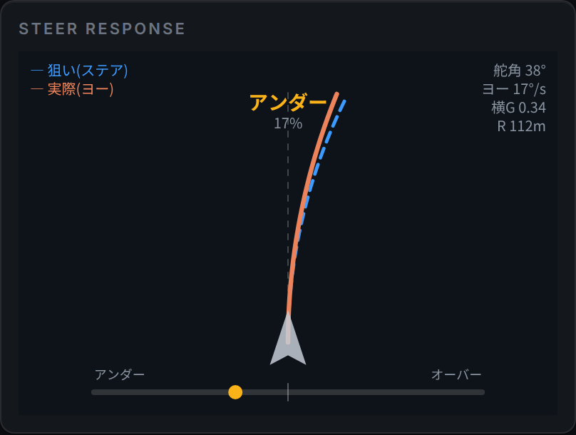

# STEER RESPONSE — 操舵応答ペイン



*図: アンダーステア 17% の例。青破線（狙い）が橙実線（実際）より深く曲がっている＝切った量ほど車が曲がっていない状態。*

## 1. 概要と30秒でわかる読み方

STEER RESPONSE は、**「ステアをこれだけ切ったら、車は実際どれだけ曲がっているか」を2本の弧で比較する**ペインです。COURSE MAP（走行軌跡）の後継として 2026-07-10 に新設されました（導入経緯は [CHANGELOG](../CHANGELOG.md) の同日エントリを参照）。

読み方は次の3パターンだけ覚えれば十分です。

| 見え方 | 意味 |
|--------|------|
| 橙（実際）が青（狙い）より**外側**（浅い） | **アンダーステア** — 切った量ほど曲がっていない |
| 橙（実際）が青（狙い）より**内側**（深い） | **オーバーステア** — 切った量より回っている |
| 2本がほぼ**重なる** | **ニュートラル** — 素直に曲がっている |

本文の構成: 第2〜3章はドライバー向け（画面の読み方と走りへの活かし方）、第4章以降は技術者向け（物理モデル・自動較正・実装）です。

## 2. 画面の読み方

実装は `steer-response.js` の `renderSteerResponse()` です。画面の各要素は以下のとおり。

### 2本の弧

- **青破線 = 狙い（ステア）**: 「今の舵角なら車はこう曲がるはずだ」という前方経路。舵角（ステアリングホイール角）から計算した曲率で、車の位置から前方 46m 分（`STEER_RESP.pathMeters = 46`）の弧を描きます。
- **橙実線 = 実際（ヨー）**: 実際のヨーレート（車体の回頭速度）から計算した曲率で描いた、実際に車が進んでいる弧。

車グリフ（矢印形）は画面下部中央に置かれ、弧はそこから上（前方）へ伸びます。中央の細い白破線は直進基準線です。弧は曲率 κ を 0.5m 刻みで前方に積分して描かれ（`steerPath()`）、κ > 0 で右曲がりです。表示値は EMA（係数 `smooth = 0.25`）で平滑化されるため、弧・バーとも急変せず滑らかに追従します。

左上には凡例（青 = 狙い(ステア) / 橙 = 実際(ヨー)）が常時表示されます。

### バランスバー（下部）

- **中央 = ニュートラル**、**左 = アンダー**、**右 = オーバー**。中央に目盛線があります。
- 目盛は**実際/期待ヨーレート比の対数**（log₂）スケールで、**2倍（または1/2倍）のズレでほぼ端**に達します（`bal = clamp(log₂(ratio), −1, +1)`）。
- 針（丸マーカー）の色は状態に連動: アンダー = 黄（`#FAB219`）/ オーバー = 赤（`#D84B4F`）/ ニュートラル = 緑（`#1F9E57`）。色の切替は平滑化後バランス値 ±0.08 が境界です。

### 右上の読み値

| 表示 | 内容 |
|------|------|
| 舵角 XX° | ステアリングホイール角（前輪切れ角ではない） |
| ヨー XX°/s | ヨーレート（車体の回頭速度） |
| 横G X.XX | 横加速度（g 単位、m/s² を 9.81 で除算） |
| R XXXm | 実旋回半径（= 1/\|κ_act\| [m]）。999m 以上（ほぼ直進）では `—` |

### 中央ラベル

画面上部中央に現在の状態（**アンダー / ニュートラル / オーバー**）を表示し、ニュートラル以外ではその下に**乖離%**（`round(|1 − ratio| × 100)`）を添えます。判定停止中（低速など）は `—` 表示です。

## 3. 走りへの活かし方

### アンダーステア（橙が青より外・バーが左）

**切った量ほど曲がっていない**状態。主因は進入速度過多かフロント荷重不足です。対処の定石:

- **進入速度を落とす** — ブレーキングを少し手前から。
- **ブレーキを残して曲げる** — フロントに荷重が乗っている間に向きを変える。
- **舵を一度戻す** — 切り足してもフロントが滑るだけ。戻してグリップを回復させてから切り直す。
- **アペックスを奥に取る** — 進入で曲げきろうとしない。

### オーバーステア（橙が青より内・バーが右）

**切った量より回っている**状態。主因はリアの荷重抜け（急なアクセルオフ・過大なスロットル）です。

- **スロットルを丁寧に** — オンもオフも急にしない。リア荷重を安定させる。
- **視線は出口へ** — 車はカウンターより先に視線で修正される。

### バーが右端に張り付く

ステアと逆方向にヨーが出ている**逆位相**の状態です（スピン中、またはカウンターステア中）。実装上は強オーバー（ratio = 2 相当）として扱われます。

### 実践例

1. **毎周同じコーナーでアンダー 15〜20% が出る** → 進入速度を 5km/h 落とすか、ブレーキリリースを遅らせてフロント荷重を残す。数値が 10% 未満に収まればライン取りの自由度が上がります。
2. **立ち上がりでバーが右へ振れる** → スロットルの踏み始めが急。開け始めを緩めて橙と青が重なる開度を探ります。
3. **切り足しても % が増えるだけ** → フロントが飽和しています。舵を一度戻し、車速を落としてから切り直します。

## 4. 物理モデル

実装は `computeSteerMetrics()`（steer-response.js）。TEST MODE の駆動側は `test-mode.js`、実走は `websocket.js` です。

### 実際の曲率 κ_act = ω / v

定常円旋回では、速度 v [m/s] で走る車がヨーレート ω [rad/s] で回頭しているとき、旋回半径は R = v/ω。曲率はその逆数なので

```
κ_act = ω / v
```

この導出に**タイヤモデルもホイールベースも不要**で、幾何的な関係だけで決まります。ただし前提は**準定常**（旋回状態がゆっくり変化する）であることです。急な切り込み・切り返しなどの過渡状態では、車体スリップ角の変化があるため κ_act は経路の曲率と乖離します（第6章参照）。コード上は v > 0.5 m/s のとき `kAct = yaw / v`、それ以下では 0 です。

### 期待ヨーレート ω_exp = v · δsw / L_eff

キネマティック自転車モデル（低速・スリップなしの幾何モデル）では、前輪切れ角 δ・ホイールベース L のとき

```
ω = v · δ / L
```

ところが GT7 の `wheel_rotation` は前輪切れ角ではなく**ステアリングホイール角**（±π rad 相当）です。ホイール角と前輪切れ角の間にはステアリングレシオ r（δsw = r·δ）があるため、これを L に畳み込んで

```
ω_exp = v · δsw / L_eff    （L_eff = r · L）
```

とします。L_eff は実装上 `STEER_RESP.neutralL`（初期値 61 = 実テレメトリ由来のフリート中央値）で、車ごとに自動較正されます（第5章）。狙いの曲率は `kCmd = ω_exp / v = δsw / L_eff`。舵角の絶対値が `minSteer = 0.05` rad 未満のときは直進扱い（kCmd = 0）です。

### バランス比と判定閾値

旋回中（判定有効 かつ |ω_exp| > 0.03 rad/s）のみ、実際と期待のヨーレート比で判定します。

```
ratio = |ω| / |ω_exp|
```

| 条件 | 判定 |
|------|------|
| ratio < 0.9 | アンダー |
| 0.9 ≤ ratio ≤ 1.1 | ニュートラル |
| ratio > 1.1 | オーバー |
| ω_exp · ω < 0（逆位相） | 強オーバー扱い（ratio = 2 に固定） |

逆位相はステアと逆向きにヨーが出ている状態（スピン/カウンター中）です。判定は `wExp * yaw < 0` の厳密な負で行い、ヨー 0 の直進プラウは逆位相に含めません。バー位置は `bal = clamp(log₂(ratio), −1, +1)` です。

`computeSteerMetrics()` の戻り値:

| フィールド | 意味 |
|-----------|------|
| `active` | 判定有効か（v ≥ minSpeed） |
| `kAct` | 実際の曲率 ω/v（v > 0.5 m/s 時。それ以下は 0） |
| `kCmd` | 狙いの曲率 δsw/L_eff（\|δsw\| < minSteer で 0） |
| `wExp` | 期待ヨーレート v·kCmd（符号付き） |
| `ratio` | バランス比 \|ω\|/\|ω_exp\|（旋回中のみ更新。既定 1） |
| `bal` | バー位置 −1（強アンダー）〜 +1（強オーバー） |
| `mode` | `'under'` / `'neutral'` / `'over'` |

## 5. 自動較正

### なぜ必要か

L_eff（中立ゲイン）はステアリングレシオ×ホイールベースなので**車ごとに大きく異なります**。固定値 61 のままだと、レシオがクイックな車では期待ヨーレートが小さく見積もられ、正常に曲がっているだけで誤ってオーバーステア判定が出ます。そこで走行中に車固有の値を学習します（`updateSteerResponse()` 内）。

### 観測量

キネマティック領域では ω ≈ v·δsw/L_eff なので、これを逆算した

```
obs = |δsw| · v / |ω|
```

がその瞬間の実効ゲインの観測値になります。

### サンプリング条件

観測値を採用する条件と、その理由:

| 条件 | 実装値 | 理由 |
|------|--------|------|
| 速度範囲 | 6 < v < 28 m/s | 低〜中速に限定 = スリップが小さく幾何（キネマティック）ゲインに近い。高速のアンダーステア分を基準に混ぜない |
| 舵角 | \|steer\| > 0.06 rad | 微小舵は分母/分子のノイズ比が大きく観測値が不安定 |
| ヨーレート | \|yaw\| > 0.02 rad/s | ゼロ割り・微小ヨーのノイズを回避 |
| 符号一致 | steer × yaw > 0 | 逆位相（スピン/カウンター）のサンプルを除外 |
| 横G | \|latG\| < 0.5g（0.5 × 9.81 m/s²） | 線形（低横G）領域に限定。タイヤ飽和域のゲインを学習しない |
| TEST MODE 除外 | `testModeActive` が真なら不採用 | 合成デモデータで実走基準を汚さないため |

### 更新式

条件を満たした観測値は EMA で緩やかに取り込みます。

```
neutralL ← neutralL + (obs − neutralL) × calibAlpha    （calibAlpha = 0.008）
```

更新後の値は `calibClamp = [25, 130]` にクランプされます。`calibAlpha` を 0 にすると較正は無効化（固定）されます。

## 6. 既知の限界

- **高横G域では軽いアンダー表示がデフォルト**: 期待ヨーレートは線形（キネマティック）モデルなので、タイヤが飽和に近づく高横G域では正常な車でも実ヨーが期待を下回り、軽いアンダー表示になります。この領域では**絶対値ではなく変化（いつもよりアンダーが強い/弱い）を読む**のが正しい使い方です。
- **wheel_rotation の素性**: GT7 の `wheel_rotation` はステアリングホイール角（±π rad 相当）で、前輪切れ角ではありません（ヨーレートとの符号一致は実測 corr +0.76）。レシオを L_eff に畳み込む前提のため、**可変ステアリングレシオの車では線形対応が崩れ**、舵角域によって判定が偏る可能性があります。
- **κ_act の過渡誤差**: κ_act = ω/v は準定常前提です。急な切り込み・切り返しの過渡では車体スリップ角が変化し、描かれる弧は実際の走行経路の曲率と乖離します。
- **単一スカラー較正の限界**: 較正されるのは L_eff という1つのスカラーだけです。速度依存のアンダーステア勾配・荷重変化・タイヤ温度などの影響は表現できず、較正した速度帯以外では基準に誤差が残ります。
- **低速では判定停止**: 速度が `minSpeed = 4` m/s 未満では判定を停止します（低速は幾何が支配的で、アンダー/オーバーの判定に意味が薄いため）。中央ラベルは `—` になります。

## 7. 実装ノート

### データフロー

```
PS5 (GT7 UDP) → telemetry.py（受信）/ decoder.py（復号）
    → WebSocket 配信 → websocket.js（実走）
                        test-mode.js（デモ・合成データ）
    → updateSteerResponse(wheel_rotation, angular_velocity_y, speed_ms, body_accel_sway)
    → computeSteerMetrics()   … 曲率・バランス比の算出
    → renderSteerResponse()   … requestAnimationFrame ループで Canvas2D 描画
```

描画は `steerRenderLoop()` が rAF で毎フレーム `renderSteerResponse()` を呼ぶ方式です（car-3d.js と同方式、依存ライブラリなし）。初期化は `steer-response.js` 読み込み時に `#steer-response-view` 要素の存在を確認して自動実行され、コンテナサイズの変化には ResizeObserver（devicePixelRatio 考慮）で追従します。

### TEST MODE でのデモ駆動

TEST MODE（test-mode.js）では合成データで一巡表示します:

- ステアホイール角はデモ操舵の 6 倍（弧が見えるよう表示拡大）。
- 実/期待ヨーレート比を 0.3〜1.3 で正弦波掃引し、**アンダー → ニュートラル → オーバー**を周期的に巡回。
- 横Gは ±0.3〜1.0g の現実的な範囲で別途生成。
- 合成データは `testModeActive` ガードにより**自動較正には使われません**（第5章参照）。

### 引数 ↔ GT7 フィールド対応

`updateSteerResponse()` の引数と供給元（websocket.js の実装より）:

| 引数 | GT7 フィールド | 単位 | 意味 |
|------|----------------|------|------|
| steerRad | `wheel_rotation` | rad | ステアリングホイール角（±π 相当。前輪切れ角ではない） |
| yawRadS | `angular_velocity_y` | rad/s | ヨーレート |
| speedMs | `speed_ms`（無ければ `speed_kmh / 3.6`） | m/s | 車速 |
| latG | `body_accel_sway` | m/s² | 横加速度（表示時に 9.81 で除して g 換算） |

### STEER_RESP 定数リファレンス

| 名前 | 実値 | 意味 |
|------|------|------|
| `neutralL` | 61（初期値） | 中立操舵ゲイン基準 L_eff（ω_exp = v·δsw/neutralL）。実測中央値。自動較正で車ごとに変化 |
| `calibAlpha` | 0.008 | 自動較正の EMA 係数（0 で較正無効＝固定） |
| `calibClamp` | [25, 130] | neutralL の許容範囲 |
| `calibSpeedMin` | 6 | 較正サンプルの速度下限 (m/s) |
| `calibSpeedMax` | 28 | 較正サンプルの速度上限 (m/s) |
| `minSpeed` | 4 | これ未満 (m/s) は判定停止 |
| `minSteer` | 0.05 | これ未満 (rad) のステアは直進扱い |
| `pathMeters` | 46 | 弧を描く前方距離 (m 相当) |
| `curveGain` | 1.0 | 曲率の表示倍率（1 = 素の幾何） |
| `smooth` | 0.25 | 表示平滑化（EMA 係数） |

## 8. 関連ドキュメント

- [ユーザーガイド](USER_GUIDE.md) — ダッシュボードの操作全般
- [TEST MODE ガイド](test-mode.md) — PS5 なしのデモでの表示確認
- [システムアーキテクチャ](architecture.md) — 全体構成・ファイル別構成表
- [CHANGELOG 2026-07-10](../CHANGELOG.md) — STEER RESPONSE の導入経緯と敵対的レビュー7件の修正記録
